# <u> Steganalysis </u>

<i> Note: Please star the repo if you find this project useful. </i>

<hr>

## Objective

The technique of steganography is gaining importance in the fields of law enforcement, intelligence and military communication. Hence, it is important to develop techniques for steganography and steganalysis to protect the data in such images.

We aim to implement different steganography algorithms that hide the texts and images into other images and also recover the hidden data from the image. To find the vulnerability of these algorithms, we then aim to detect if text has been concealed in the images using methods of vulnerability analysis like histogram analysis, chi-square analysis, pairs analysis, compression and reformat attack. After this we will prepare a vulnerability assessment report highlighting the vulnerabilities and scope of improvement of each such algorithm.

<hr>

## Steganalysis Algorithms

There are five stegoanalysis algorithsm used and it contains the all the code of the algorithms in python. Ensure that you have python installed.

```
git clone https://github.com/kaustubh0201/Steganalysis.git
cd Steganalysis
cd Steganalysis_Algorithms
source bin/activate
# Now the python environment will be active
pip3 install matplotlib
pip3 install opencv-python
pip3 install scipy
```

<i>Note: For exiting the python environment, use <code>deactivate</code> in the terminal. </i>

For running any of the algorithms use the following command.

```
python3 RSAnalysis.py
# Similarly, you can do with other algorithms
```

<hr>

## Steganography Algorithms

For running any of the three algorithm, written from scratch using C, using terminal can be done using the below. Ensure that you have gcc if you want to compile <code>main.c</code> yourself.

```
git clone https://github.com/kaustubh0201/Steganalysis.git
cd Steganography_Algorithms
```

For encryption, do the following:

```
./main -e PVD_greyscale message /path/to/image
# you will get your image in the path along with the recovery key
```

For decryption, do the following, <code>recovery_key</code> will be an integer which you got during encryption:

```
./main -d PVD_greyscale recovery_key /path/to/encrypted/image
# You will get your message in the terminal
```

<i>Note: PVD_greyscale can be changed to Edge_LSB or Reversible_DCT according to the use case.</i>

<hr>

## Web Application

The web application is developed using Django. The web application can be used to encrypt a message in an image and can also be used to decrypt it. 

#### Running the application

```
git clone https://github.com/kaustubh0201/Steganalysis.git
cd Steganalysis
cd Web_Application
pipenv shell
# Now the python environment will be active
pipenv install
cd stego
python3 manage.py runserver
```

<i> Note: If pipenv gives error that it doesn't know which python to use then do the following: </i>

```
which python3 
# here you will get the location, ensure that your have python3 installed
pipenv --python path/to/python
```

<i> For exiting the python environment, use <code>exit</code> in the terminal.</i>

After the server is up, go to the url <code>http://127.0.0.1:8000/encrypt</code>.

<b> Step 1: </b> Upload the image and then put the message you want to get encrypted in the image.<br>
<b> Step 2: </b> Choose the encryption algorithm among the three.<br>
<b> Step 3: </b> Click on Submit button. You will be redirected to next page.<br>
<b> Step 4: </b> You will see the encrypted image and the recovery key associated with it.<br>

<i> Note: Recovery key will be used in the decryption of message from the image. </i>

Now, for decryption, go to the url <code> http://127.0.0.1:8000/decrypt</code>.

<b> Step 1: </b> Upload the encrypted image.<br>
<b> Step 2: </b> Choose the encryption algorithm among the three.<br>
<b> Step 3: </b> Put the recovery key in text box.<br>
<b> Step 4: </b> Click on Submit button. You will be redirected to next page.<br>
<b> Step 5: </b> You will see the encrypted message.


<hr>

## Methodology

The role of data encryption algorithms is to scramble the data such that the original content of the data can’t be accessed by the unauthorised parties. Even though there are multiple data encryption algorithms that are virtually unbreakable with today’s computing technology, they have a fundamental weakness that the attacker can still know if data is being shared between multiple parties even if the data is secured by a modern cipher. Steganographic techniques are used to supplement the encryption algorithms by hiding the data (preferably encrypted data) in such a manner that no one other than the sender and recipient recognize whether data is being transferred or not. Unlike encryption, the main purpose of steganography is defeated when the communication between two parties is detected, even if the actual data can’t be deciphered by the attacker.

In this project we plan to implement a total of 3 algorithms, keeping in mind the various limitations discussed in the literature review. The algorithms are listed below:

- <b> Pixel Value Difference 2x substitution </b>
- <b> Reversible Discrete Cosine Transform </b>
- <b> Edge detection based steganography </b>

The project can be divided into 3 basic modules :

- <b> Identification: </b> In this module, we identify relevant research papers and shortlisted the algorithms which seemed implementable and viable keeping in mind the scope of the project.
- <b> Algorithm Implementation: </b> In this module, we are going to implement the 3 steganography algorithms mentioned above.
    - We will try to improve on the limitations of some of the implemented algorithms such as the limitation on the capacity of LSB using edge detection algorithm and precision problems in reversible DCT algorithm.


- <b> Vulnerability Analysis: </b> In this module, we aim to test each of our implement algorithms for vulnerabilities using the following methods of vulnerability analysis and make a detailed report highlighting the vulnerabilities of each.
    - <b> Histogram Analysis: </b> The histogram is made by the difference between two pixels of the block. Generally in normal image, the number of occurrences of the pixel difference, h(d) decreases with increasing |d| where d is the difference in the two pixels. After that we plot the difference between the number of occurrences of pixel difference to visually detect the presence of a secret message. The excessive high frequency components associated with the steps of  analysing using the histogram, and it will also provide a signature of the secret message. The vulnerability it uses is that the difference between the adjacent pixels can lead to the location of the hidden bytes in the pixels.
    - <b> Chi Squared Analysis: </b> It is a common observation that the embedding of encrypted data changes the histogram of color frequencies in a particular way. The embedding process changes the least significant bits of the colors of the image. In this technique, the colors are addressed by their indices in the color table. To put it simply, the frequency difference between adjacent colors is reduced by the embedding process. Thus a chi-squared test can be used to determine whether color frequency distribution in an image matches a distribution that shows distortion when hidden data is embedded. The principle behind this attack is that in a normal image the frequencies of each of the two pixel values in each POV tend to lie far from the mean of the POV. However, when a text is embedded in the image, these tend to become nearly the same or in some cases, equal. In this way, we can identify whether a given image has embedded text in it and consequently state the above vulnerability.
    - <b>RS Analysis: </b> The RS analysis is based on the fact that the content of each bit plane of an image is correlated with the remaining bit planes. We analyse how the number of R (regular) and S (singular) groups of pixels changes with the increase in the message length embedded in the LSB plane. To examine the image we define regular and singular groups of pixels based on how the smoothness of the pixels change when subject to flipping. We then find the relative frequencies of these groups in the given image, in the image obtained by flipping the LSBs of the original image and in the image obtained from randomising the LSBs of the original image. Using these three frequencies we try to predict the length of the embedded image.
    - <b> Pairs Analysis:</b> It is used to detect the data hidden in palette images. It detects messages embedded in palette images as LSBs of indices to palette colors along a random walk. Its principle is based on color pairs. Let’s say that colors c1, c2 are extracted from the image by scanning it by rows and columns. The sequence of colors is then converted to a binary vector by associating c1 with 0 and c2 with 1. After solving all the equations stated in the analysis, we can find out the length of the message hidden in the image. It shows that the function defined by the difference between the two homogeneity is quadratic in the amount of embedded data. It works on the weakness that natural images have no difference in homogeneity, one can obtain enough information to deduce the amount of embedded data in the image.
    - <b> Compression and reformat attack: </b> In this attack the attacker tries to destroy the embedded image by performing image compression or changing the file format of the image. The principle behind this attack is image manipulation like compression and reformatting changes the content of the image data without changing the image visually. If this attack is successful, then it will tell us that the steganography algorithm is vulnerable to image manipulation and work needs to be done to improve the robustness of the algorithm.

## Results

1. <b><u> Histogram Analysis</u> </b>

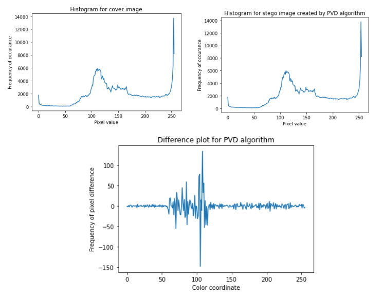

<p align="center">Histogram Analysis on Pixel Value Difference 2x Substitution Algorithm generated Stego Image</p>

<hr>


<p align="center">Histogram Analysis on Reversible Discrete Cosine Transform Algorithm generated Stego Image</p>

<hr>


<p align="center">Histogram Analysis on Edge Detection Based Steganography Algorithm generated Stego Image</p>

<hr>

2. <b> <u> RS Analysis </u> </b>

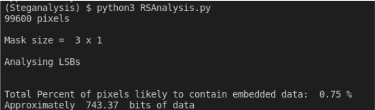

<p align="center">RS Analysis on Original Image</p>

<hr>


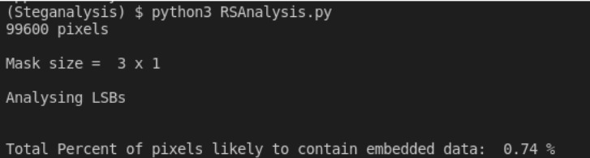

<p align="center">RS Analysis on Pixel Value Difference 2x Substitution Algorithm generated Stego Image</p>

<hr>

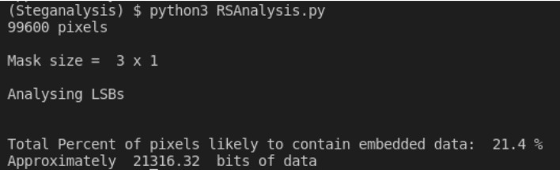

<p align="center">RS Analysis on Reversible Discrete Cosine Transform Algorithm generated Stego Image</p>

<hr>

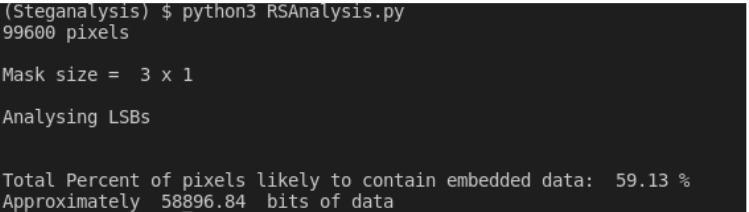

<p align="center">RS Analysis on Edge Detection Based Steganography Algorithm generated Stego Image</p>


<hr>

3. <b> <u> Pairs Analysis </u> </b>

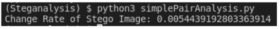

<p align="center">Pairs Analysis on Original Image</p>

<hr>


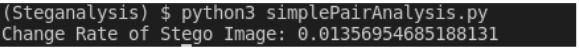

<p align="center">Pairs Analysis on Pixel Value Difference 2x Substitution Algorithm generated Stego Image</p>

<hr>


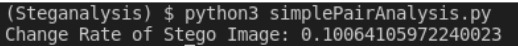

<p align="center">Pairs Analysis on Reversible Discrete Cosine Transform Algorithm generated Stego Image</p>

<hr>


<p align="center">RS Analysis on Edge Detection Based Steganography Algorithm generated Stego Image</p>

<hr>

4. <b> <u> Chi Square Analysis </u> </b>

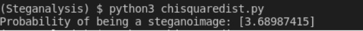

<p align="center">Chi Square Analysis on Pixel Value Difference 2x Substitution Algorithm generated Stego Image</p>

<hr>

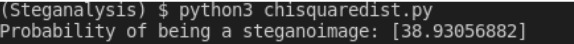

<p align="center">Chi Square Analysis on Reversible Discrete Cosine Transform Algorithm generated Stego Image</p>

<hr>

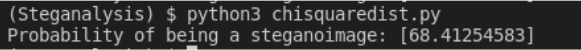

<p align="center">Chi Square Analysis on Edge Detection Based Steganography Algorithm generated Stego Image</p>

<hr>

5. <b> <u> Compression Reformat Attack </u> </b>

- <b> Original Text </b>

Far far away, behind the word mountains, far from the countries Vokalia and Consonantia, there live the blind texts. Separated, they live in Bookmarksgrove right at the coast of the Semantics, a large language ocean. A small river named Duden flows by their place and supplies it with the necessary regelialia. It is a paradigmatic country, in which roasted parts of sentences fly into your mouth. Even the all-powerful Pointing has no control about the blind texts; it is an almost orthographic life. One day however a small line of blind text by the name of Lorem Ipsum decided to leave for the far World of Grammar. The Big Oxmox advised her not to do so, because there were thousands of bad Commas, wild Question Marks and devious Semikoli, but the Little Blind Text didn’t listen. She packed her seven versalia, put her initials into the belt and made herself on the way. When she reached the first hills of the Italic Mountains, she had a last view back on the skyline of her hometown.

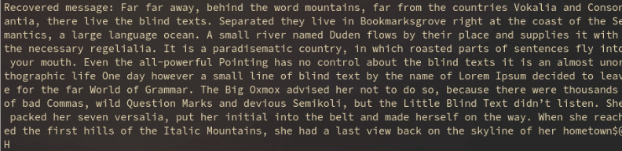

<p align="center">Compression Reformat Attack on Pixel Value Difference 2x Substitution Algorithm generated Stego Image</p>

<hr>

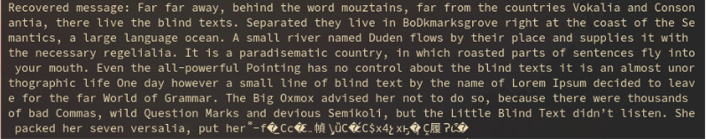

<p align="center">Compression Reformat Attack on Reversible Discrete Cosine Transform Algorithm generated Stego Image</p>

<hr>

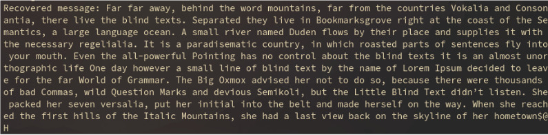

<p align="center">Compression Reformat Attack on Edge Detection Based Steganography Algorithm generated Stego Image</p>

<hr>

## <u> Vulnerability Assessment </u>

### Background

Digital steganography provides potential for private and secure communication that has become the necessity of most of the applications in today’s world. Cryptosystems have various challenges that render them vulnerable. Since the cryptosystem ensures data security and integrity, the weaknesses of such systems are very critical. Various steganographic algorithms are used for hiding such secret information and a large variety of image steganography techniques are available with their respective advantages and disadvantages. Some algorithms provide more payload capacity while some provide more robustness against attack. Steganography can have two types based on its purposes-protection against detection(data hiding) and protection against removal(document marking by fingerprinting or watermarking). In our report, we mainly focus on the first category. Steganalysis is the technology that attempts to defeat steganography, by detecting the hidden information and extracting or destroying it.

<hr>

### Objectives

Following is the indicative list of activities envisaged to meet the scope of work:

1. <b> Vulnerability Assessment & Penetration Testing (Steganalysis) </b> - White Box
testing of the following algorithms: Pixel Value Difference 2x
Substitution, Reversible Discrete Cosine Transform and Edge based detection
technique.

2. <b> The penetration testing is performed by carrying out the following attacks on
each of the algorithms </b> : Histogram analysis, Chi-Square analysis, RS Analysis,
Sample pair analysis and lastly, Compression testing.


The objective of performing this Vulnerability Assessment is to create an overview of the security risks to the various steganography algorithms and then use these as a guideline to resolve those threats.

Further, we aim to provide certain guidelines/recommendations and remediations as to how one can enhance the security of these algorithms against the 5 attacks we have tested them against. We further discussed some recommendations for the use of these algorithms in information security use cases.

<hr>

### Types of Image Steganography Algorithms

Digital images are the most widely used cover objects for steganography. Due to the availability of various file formats for various applications the algorithm used for these formats differs accordingly. In the report, we have implemented only those algorithms that support a number of image types so as to increase the scope of this vulnerability assessment.

Large amounts of data can be encoded into 24-bit images as it is compared to 8-bit images. The drawback of 24-bit digital images is their size which is very high and this makes them suspicious due to their heavy size when compared to 8-bit images. Depending on the type of message and type of the image different algorithms are used.

The following are some common types of stego algorithms:

- Least significant bit insertion
- Masking and filtering
- Redundant Pattern Encoding
- Encrypt and Scatter
- Algorithms and transformations
- Least significant bit insertion

Several domains exist for image steganography. Important steganographic domains are:

- <b> Spatial Domain Techniques : </b> Spatial domain techniques include bitwise manipulation of intensity of pixels and noise manipulation. There are various approaches to embed data in spatial domains. Most commonly used and simple techniques for spatial domain are Least Significant Bit (LSB) Methods.

-  <b> Transform domain Techniques: </b> Transform domain techniques are also known as frequency domain techniques. Transform domain techniques first convert images from spatial domain to frequency domain and then a secret message is embedded. These techniques hide data by using mathematical functions. We often use these techniques in compression algorithms and transformations involve hiding secret messages in the transform space of the cover object. In Frequency domain schemes, the secret data will be embedded into transform coefficients which are transformed first into frequency domain by various frequency domain methods like Discrete Cosine Transformation (DCT), Discrete Wavelet Transform (DWT), Discrete Fourier Transform (DFT) etc then secret data will be embedded into transform coefficients.

- <b> Distortion techniques: </b> Here the secret message is embedded by distortion of cover and measuring deviation between original cover and stegos at decoding stage. Distortion techniques are less secure and are not used in various applications because original cover objects may be available to steganalysis for comparison. Text based steganography techniques generally use distortion type for embedding.

- <b> Masking and Filtering: </b> This technique masks secret data over original data by changing the luminance of particular areas. It embeds the message within significant bits of the cover image. Unlike LSB, masking is not susceptible to lossy techniques because image manipulation does not affect the secret message because masking adds redundancy to the hidden information. This makes the masking technique more suitable than LSB with lossy JPEG images. It may also help to protect against some image processing operations such as cropping and rotating.

<hr>

### Challenges in Steganography

- Steganographic techniques are very sensitive to various modifications in cover medium like Image processing operations (smoothing, filtering, image transformations etc.) compression techniques, removing and filtering digital noise techniques because these techniques lead to removal or modifications of secret embedded information too.

- Hidden messages must be secure both from perceptual and statistical attacks. There is a requirement to design more robust steganography algorithms and there is need to pay special attention for the presence of active and malicious attacks.

- Steganography algorithms have difficulty providing high payload capacity and imperceptibility. If a technique provides high payload capacity then it may become less robust and vice versa. Requirements for higher capacity and secure communication are often contradictory . Depending upon the specific application this trade off needs to seek out and at the same time there is also a need to produce a high quality stego algorithm by achieving high value of PSNR (Peak Signal to Noise Ratio).

- It is also a challenge to embed message into group images, which are highly intercorrelated and often manipulated in compressed form.

<hr>

### Methodology

To test the security of the implemented steganographic algorithms, we have taken 6 sample cover images titled [1] pup [2] baboon [3] bear [4] barbara [5] lena [6] critter. Secret messages were hidden in each of these images using the three implemented steganographic algorithms. To exploit vulnerabilities in each of these algorithms, steganalysis was carried out on each of these images. The stego image is made by embedding 50% pixels of the cover image with some message.

<b> The results were noted to find the number of times each algorithm was breached which in turn is used to determine whether the algorithm is immune against the attack. 

An algorithm was deemed to be “breached” by a particular attack if and only if more than 3 images i.e 50% of sample space has values greater than the thresholds of the respective attacks (specified below). </b>


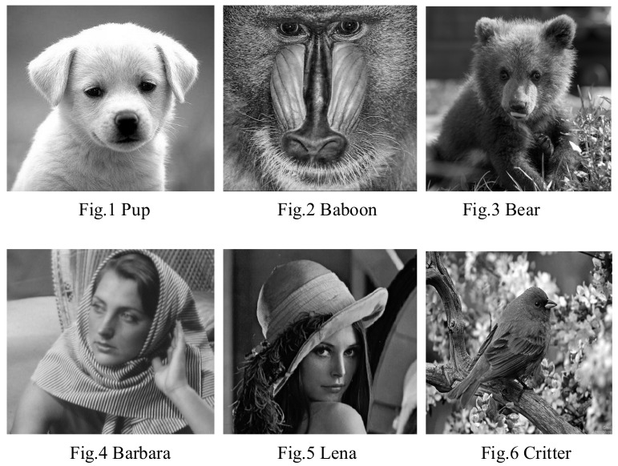

#### RS Analysis

The RS Analysis basically checks the regular and singular groups of pixel change with the increase in the length of the message in the LSB plane. We can say that this analysis is effective for stegano images that have the LSB embedding. The RS Analysis tries to predict the length of the message by analysing the frequencies of these regular and singular groups. We have applied the RS Analysis for different stego images for each of the algorithms that have been implemented. Based on the observations, we have found out that if the result is coming out to be <b> more than 7%, </b> then we can say that there is some major data embedded in the image.

<hr>

#### Histogram Analysis

To find the vulnerability of the steganographic algorithms using histogram analysis, we find the number of color coordinates that differ between the cover image and the stego image. We count the number of coordinates that show a difference more than 10% from the original coordinates. Finally, this number is converted to per cent value. Based on our experiments, <b> an optimal threshold of 70% </b> was set to find if the attack was successful or not.

<hr>

#### Chi Square Analysis

The idea of the chi-square attack is to compare the theoretically expected frequency distribution in the cover image with some possibility of distortion caused by the hidden message. To do this, the chi-square distance between corresponding color coordinates in the cover and stego images was calculated. <b> The greater the total chi-square distance value, the greater the probability of a hidden message. </b>

<hr>

#### Pairs Analysis

The pair analysis basically detects the data in images as LSBs of indices. The function defined by the difference between the LSBs is quadratic in the amount of the embedded data. After solving the equation given according to the analysis, we can find out the rate at which there is change in the stego image due to the embedded data. <b> If the rate is greater than 0.08% </b> then we can say that there is some major data embedded in the stego image.


<hr>

#### Compression Attack

The main logic behind this attack is that if the image is compressed then the embedded data will be changed. It doesn’t change the appearance of the image but the hidden content is distorted. This attack was done on various stego images with data embedded with each of the different algorithms. It was observed that the compression attack does not work on the Edge LSB algorithm but we can see that none of the messages could be recovered from the stego images generated from Reversible DCT.

We have put in the table the <b> percentage of values that could be recovered from the stego image after compression it for each of three algorithms.</b>

<hr>

### <u> Vulnerability Assessmnent Findings </u>

#### PIXEL VALUE DIFFERENCE 2x SUBSTITUTION


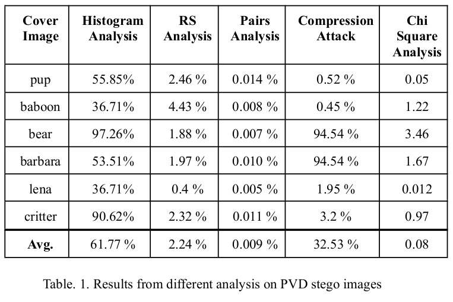

It is clearly observable from the above table that PVD is most vulnerable to statistical attacks like Histogram Analysis and Compression attack.

This can be attributed to the following <b> vulnerabilities </b> in the algorithm:

1. <b> Raster Scanning: </b> In the PVD algorithms implemented, a raster scanning order is typically employed for dividing the embedding units, which means that only vertical edges can be used. At the same time, such fixed division will leave some revealing clues for detectors. For instance, we can analyze some statistical artifacts in the PVD histogram to expose the stego images and estimate the size of hidden data.

2. <b> Contiguous ranges: </b> The above approach employs fixed contiguous ranges to classify the differences between the pixel values in the embedding unit, which will lead to undesired steps appearing at the PVD histogram thus breaking its imperceptibility.

3. <b> Contamination of Smooth regions: </b> On experimentation, it was found that the
PVD algorithm tends to embed data in “busy” regions of the image. However due to this trait, smoother regions of the image were affected which are found to be more exploitable by the attacks instead of less detectable regions like “edges”.

<hr>

#### PIXEL VALUE DIFFERENCE 2x SUBSTITUTION

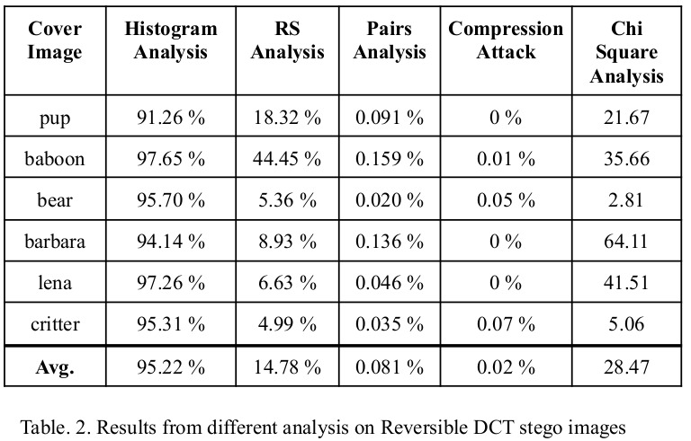

Reversible discrete cosine transform is vulnerable to histogram analysis and resistant to RS analysis and pairs analysis. Its vulnerability to histogram analysis is explained by:

1. <b> Drastic changes in Pixel values: </b> This algorithm causes a lot of changes in the colour of pixels. This change in pixel colours is easily observable when comparing the histogram of the cover and stego images.

2. Another possible vulnerability is due the fact that the image is processed in 8x8 blocks and between the edges of two blocks there can be artifacts that are causing significant differences between the histogram of cover and stego images.

<hr>

#### EDGE DETECTION BASED STEGANOGRAPHY

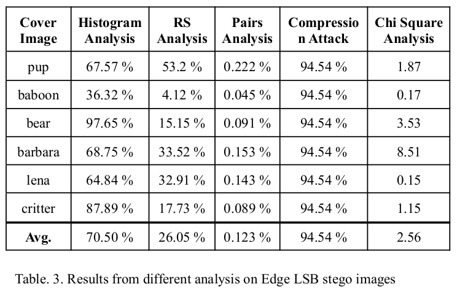

Edge detection based steganography is most susceptible to RS analysis and least susceptible to compression attack.

This vulnerability can be attributed to the following factors:

- <b> Uneven embedding: </b> Using this method, only 2 or 3 bits can be hidden per pixel. In the cases where the payload is increased beyond this threshold, the image quality is reduced noticeably.

- Another evident weakness is that this type of encoding can easily be decoded by converting the stego image in binary format and extracting the edge bits as specified.

<hr>

### Summary

Based on the averages calculated, below is the summary that can be derived from the analysis conducted above:

1. RDCT was breached by Histogram analysis attacks in almost all instances suggesting that it was the least secure algorithm against statistical attacks. On the other hand, PVD performed the best against Histogram analysis.

2. Edge detection based steganography algorithm had the message detection percentage against RS analysis while PVD held against this attack.

3. Edge based detection had the highest percentage of message recovered which indicates its weakness against Image manipulation attacks.

The algorithm that best performs against all the attacks conducted was found to be pixel value difference(PVD) 2x substitution. However, there is still some scope of improvement which is described in the below sections.

<hr>

### Remediations

1. <b> EDGE BASED LSB </b> 

- To reduce the effectiveness of RS analysis, we can randomise the plane in which the data bit is hidden. For example, in one edge pixel we can hide data in the 8th bit of the pixel and in another edge pixel we can hide the data in the 4th bit of the pixel.
- We can use advanced edge detection algorithms based on deep learning to better identify pixels in which data should be embedded. 
    
<br>

2. <b> PIXEL VALUE DIFFERENCE </b>

<b> Inorder to increase the security of PVD algorithm, following are some promising improvements that can be adopted: </b>

- Instead of adopting Raster scanning for division of embedded units, we can first divide the cover images into non-overlapping squares, and rotate them by a degree of 0, 90, 180 or 270 randomly. In such a way, both horizontal and vertical edges in images can be used. Moreover, tracking the embedding units from the stego images becomes impossible without the rotation key, which makes the detection more difficult.

- To defeat the histogram based steganalysis, we can employ a pseudo-random dithering to the fixed ranges. The experimental results show that the improved approach can avoid the occurrence of the undesired steps in the histogram effectively.

- To ensure that smooth regions of the image are not extensively used we can employ an optional threshold T to measure the edge strength for each embedding unit. When performing data embedding, our method can first estimate whether the embedding units whose strength is larger than T are enough for a given secret message. If not, the method decreases the threshold T to T − 1 to release more spaces, until all of the secret message can be embedded completely. In such a way, most smooth/flat regions in cover images can be well preserved.

3. <b> REVERSIBLE DISCRETE COSINE TRANSFORM </b>

<b> Inorder to increase the security of reversible DCT, following are some promising improvements that can be adopted: </b>

- We can decrease the size of the blocks which are applied to the image. This will decrease the number of pixels that are being affected by the application of the algorithm and reduce the difference between adjacent blocks in the stego image.

- We can reduce the amount of data stored per block to lessen the changes in the values of pixels. This will reduce the difference between the histograms of cover and stego images.

<hr>

### Conclusion

All in all, each algorithm had properties and methods that led to the images generated by them being immune against certain attacks and weak against others. From the vulnerability analysis conducted, certain noteworthy points can be derived:

- In case of statistical attacks, RDCT proved to be the least secure among all algorithms tested.
- Edge detection based steganography proved weak against RS analysis and image manipulation attacks(in this case, compression).
- PVD was found to be the most versatile algorithm of the three.
- However, each algorithm had certain vulnerabilities which could potentially be exploited and thus certain recommendations were provided to increase the security of these algorithms. Also, certain use cases were provided towards the end for better clarity in this respect.
